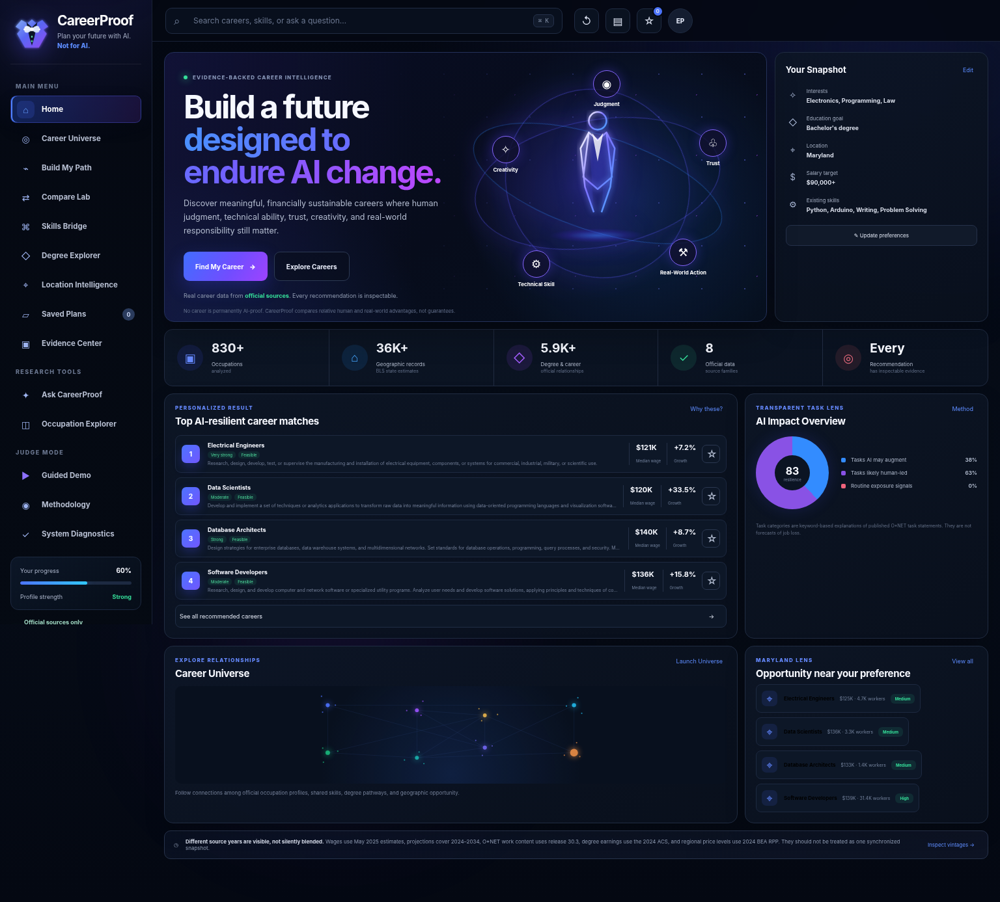

# CareerProof AI

## Plan your future with AI. Not for AI.

CareerProof AI is a working **Track 2: Trustworthy Data Analysis** product that helps students and early-career users answer a difficult question:

> **Which career fits my interests and constraints, offers a financially sustainable path, and retains strong human and real-world advantages as AI changes work?**

CareerProof does not claim that any job is permanently AI-proof. It interprets a user goal, calculates recommendations from bundled official data, exposes the formula and tradeoffs, and lets the user challenge every result.

> **AI interprets. Code calculates. Evidence verifies. You decide.**



## Why it matters

Career information is spread across large government tables, occupational databases, education crosswalks, and regional price data. Generic career quizzes rarely show their evidence. Unrestricted chatbots may summarize career information without proving a number or recognizing when the data cannot answer a question.

CareerProof turns that fragmented evidence into a controlled decision workflow:

1. **Discover** relevant careers.
2. **Compare** the strongest options with user-controlled priorities.
3. **Verify** every important number and derived score.
4. **Plan** practical next steps while keeping the user in control.

## Verified bundled coverage

The current build loads and validates:

- **830** detailed occupations
- **36,168** state occupation records
- **5,917** degree-to-occupation relationships
- **2,142** instructional programs
- **51** state and District of Columbia regional price parity records
- **8** documented official source families
- May **2025** national and state wage estimates
- **2024–2034** employment projections
- O*NET release **30.3** work content
- **2024 ACS 1-Year** broad degree-field earnings

The application contains **no synthetic labor-market records**.

## What the presentation-ready 4.1 build adds

### A two-stage Path Builder

The user can describe their goals in normal language and structured controls. CareerProof first presents an editable interpretation containing:

- Interests and existing skills
- Work environment preferences
- Education ceiling
- Salary target
- Preferred location
- Relocation and remote preferences
- Hard constraints versus soft preferences
- Eight decision weights

The user confirms or edits that interpretation before ranking begins.

### Hard feasibility gates

Education, salary, and location can be marked as hard constraints. A career that violates a hard constraint is blocked before it can win the ranking. Near misses remain visible with the exact reason they were excluded.

### Eight transparent decision components

Every recommendation exposes:

1. Interest and skill fit
2. Career resilience
3. Salary
4. Projected growth
5. Annual openings
6. Education access
7. Location fit
8. Market stability

The interface shows raw values, normalized scores, user weights, weighted contributions, the final formula, and missing-data warnings.

### Career Resilience Profile v1.0

The model compares six inspectable dimensions derived from official occupation descriptions and O*NET work content:

- Human trust: **18%**
- Physical-world complexity: **18%**
- High-stakes judgment: **20%**
- Creativity and adaptation: **16%**
- Credential and regulatory barrier: **12%**
- Inverse routine-automation exposure: **16%**

AI augmentation potential is displayed separately. Every dimension exposes matched signals and relevant official task examples.

The score is a **relative CareerProof decision aid**, not an official automation probability or a prediction that a job will survive.

See [the full model card](docs/RESILIENCE_MODEL_CARD.md).

### Recommendation challenger

Every top result includes a **Challenge this recommendation** panel showing:

- Weakest score components
- Missing or limited evidence
- Important assumptions
- Strongest alternative
- The question that could change the decision

### Counterfactual decision testing

CareerProof recalculates rankings under multiple presets:

- Balance everything
- Maximize income
- Maximize AI resilience
- Maximize opportunity
- Minimize education burden
- Prioritize location

The user can see exactly what would move a different career into first place.

### Career portfolio strategy

Instead of forcing one irreversible choice, CareerProof produces:

- Primary path
- Safer backup
- High-upside option
- Fast-entry option

### Evidence Passports

Important results can be opened into an evidence view containing:

- Direct official values
- CareerProof-derived values
- Source agencies and vintages
- Calculation formula
- Weighted contributions
- Source confidence
- Decision confidence
- Limitations and missing evidence

### Safe refusal

CareerProof refuses claims the bundled data cannot verify, including guaranteed outcomes, employer happiness rankings, causal degree-to-salary claims, discriminatory comparisons, live vacancies, and arbitrary code execution.

Example:

```text
Which bachelor's degree guarantees the highest salary after becoming a lawyer?
```

The application explains that broad degree-field earnings and lawyer occupation wages do not create a verified causal link, then suggests supported questions.

## Main workspaces

- **Home**: premium decision dashboard, verified coverage, top matches, AI-impact lens, local opportunity, and freshness warning
- **Career Universe**: functional category-to-career graph backed by defined relationships
- **Build My Path**: editable interpretation, hard gates, transparent ranking, challenger, sensitivity, and roadmap
- **Compare Lab**: two-to-four career tradeoff analysis with eight score dimensions
- **Skills Bridge**: O*NET skill, software, task, wage, growth, and education transition analysis
- **Degree Explorer**: official qualitative CIP-to-SOC pathways
- **Location Intelligence**: BLS wages and employment adjusted with BEA regional price parities
- **Saved Plans**: career shortlist and decision journal stored locally in the browser
- **Evidence Center**: source catalog, model card, data quality, guardrails, and live diagnostics
- **Ask CareerProof**: supported natural-language questions with visible query plans and safe refusal
- **Occupation Explorer**: unified occupation profile across wage, outlook, O*NET, degree, and location evidence
- **Judge Mode**: a timed 10-stage presentation with full and quick modes, visible rubric alignment, presenter narration, live-feature launch controls, autoplay, keyboard navigation, and one-click reset

## Data sources

| Source family | Vintage | Use |
| --- | --- | --- |
| BLS Occupational Employment and Wage Statistics, national | May 2025 | National employment and wage distribution |
| BLS Occupational Employment and Wage Statistics, state | May 2025 | State wages, employment, concentration, and estimate quality |
| BLS Employment Projections | 2024–2034 | Growth, annual openings, education, experience, and training |
| BLS OEWS by typical entry education | May 2025 | Education-level wage comparisons by geography |
| O*NET Database | 30.3 | Descriptions, skills, knowledge, tasks, technologies, and job zones |
| Census ACS B15013 | 2024 1-Year | Broad bachelor’s-field median earnings and margins of error |
| BEA Regional Price Parities | 2024 | State purchasing-power adjustment |
| NCES/BLS CIP-to-SOC crosswalk | CIP 2020 / SOC 2018 | Qualitative instructional-program relationships |

Full provenance, authoritative URLs, licenses, retrieval notes, row counts, and checksums are in [docs/DATA_SOURCES.md](docs/DATA_SOURCES.md) and [data/metadata/data_catalog.json](data/metadata/data_catalog.json).

## Different source years are not silently blended

CareerProof displays a freshness warning because the official sources describe different periods. Wages, projections, O*NET profiles, degree earnings, and regional prices are useful together as decision context, but they are not one synchronized measurement.

## Architecture

```text
User question or career profile
        ↓
Controlled interpretation and entity resolution
        ↓
User review of goals, constraints, and weights
        ↓
Allowlisted source route and exact occupation-code joins
        ↓
Deterministic calculations and hard feasibility gates
        ↓
CareerProof explanation, confidence, challenge, and evidence
        ↓
Human-controlled comparison, shortlist, roadmap, or report
```

No user text or model output is executed as Python or unrestricted SQL.

See [docs/ARCHITECTURE.md](docs/ARCHITECTURE.md) and [docs/architecture.svg](docs/architecture.svg).

## Install and run

Python 3.11 or newer is required.

```bash
cd careerproof-ai
python3 -m venv .venv
source .venv/bin/activate
python -m pip install --upgrade pip
python -m pip install -r requirements-dev.txt
python app.py
```

Open:

```text
http://127.0.0.1:7860
```

The server honors the deployment `PORT` environment variable and binds to `0.0.0.0` when launched through `app.py`.

## Test and verify

```bash
PYTHONPATH=src pytest -q
PYTHONPATH=src python scripts/run_demo_checks.py
PYTHONPATH=src python scripts/judge_diagnostic.py
PYTHONPATH=src python scripts/smoke_test_app.py
PYTHONPATH=src python scripts/browser_acceptance.py
PYTHONPATH=src python scripts/verify_submission.py
```

Current verified results:

- **83/83** unit and integration tests passed
- **19/19** question and advanced workflow checks passed
- **11/11** judge diagnostic checks passed
- **39/39** Chromium browser acceptance checks passed
- Server smoke test passed
- Submission checksum, secret, placeholder, and packaging verification passed
- No browser console errors or page errors
- 390-pixel layout produced zero horizontal overflow

The browser acceptance suite runs the production template, CSS, and JavaScript in Chromium while routing frontend requests to the real FastAPI application through `TestClient`.

## Demonstration path

Judge Mode now provides a **7:50 full presentation** and a **4:25 quick pitch**. Both modes use the same verified backend payload, display suggested narration, highlight the active scoring category, and can launch the matching live feature.

The demonstration uses this profile:

- Electronics, programming, and law interests
- Python, Arduino, writing, and problem-solving skills
- Bachelor’s degree hard ceiling
- Maryland preference
- $90,000 median salary target
- AI resilience as a major priority

Full presentation sequence:

1. Establish the student problem and product purpose.
2. Show the editable AI interpretation and human approval step.
3. Calculate the Path Builder recommendation with hard gates and eight visible score components.
4. Challenge the recommendation and expose weaknesses, assumptions, and counterfactuals.
5. Compare tradeoffs and show how priorities change the result.
6. Verify a cost-of-living answer with source rows, formulas, confidence, and limitations.
7. Demonstrate safe refusal for an unsupported guarantee.
8. Turn the analysis into a career portfolio and roadmap.
9. Explain the six-stage architecture in plain language.
10. Close against all six judging categories.

See [docs/DEMO_SCRIPT.md](docs/DEMO_SCRIPT.md).

## Free public deployment

[](https://render.com/deploy?repo=https://github.com/PandaExpress15/hackathon)

The repository is ready for a free Render web service:

- `render.yaml` defines the service, build command, start command, and health check.
- `Procfile` provides the production start command.
- `Dockerfile` provides a portable container build.
- `app.py` binds to `0.0.0.0` and honors the platform-provided `PORT`.
- `/api/health` supports deployment health checks.

See [docs/DEPLOYMENT.md](docs/DEPLOYMENT.md) for the exact public deployment and verification steps. Free services may sleep when idle, so wake the site before judging.

## Important limitations

- CareerProof is not a live job board.
- Published estimates describe occupation groups, not individual offers or outcomes.
- Projections are estimates, not guaranteed future vacancies.
- The resilience model is transparent but heuristic and relative.
- Keyword presence cannot capture every workplace nuance.
- State price parity does not represent an individual household budget.
- O*NET describes typical work and may not match every employer.
- Degree crosswalks are conceptual, not placement rates or legal requirements.
- Remote preference is disclosed but not scored because the bundled data does not provide a reliable occupation-level remote-work measure.
- CareerProof scores reflect user choices and do not define an objectively best career.

See [docs/LIMITATIONS.md](docs/LIMITATIONS.md).

## Submission materials

- [JUDGING_ALIGNMENT.md](JUDGING_ALIGNMENT.md)
- [docs/PRESENTATION.md](docs/PRESENTATION.md)
- [docs/PRESENTATION.html](docs/PRESENTATION.html)
- [docs/DEMO_SCRIPT.md](docs/DEMO_SCRIPT.md)
- [docs/PRESENTATION_READY_BUILD_REPORT.md](docs/PRESENTATION_READY_BUILD_REPORT.md)
- [docs/FINAL_98_BUILD_REPORT.md](docs/FINAL_98_BUILD_REPORT.md)
- [docs/TESTING_REPORT.md](docs/TESTING_REPORT.md)
- [docs/DEPLOYMENT.md](docs/DEPLOYMENT.md)
- [docs/browser_acceptance_results.json](docs/browser_acceptance_results.json)
- [docs/presentation_ready_build_manifest.json](docs/presentation_ready_build_manifest.json)
- [SUBMISSION_CHECKLIST.md](SUBMISSION_CHECKLIST.md)

## License and disclosure

Project code is MIT licensed. Official data and third-party components remain subject to their source terms. O*NET content is used under Creative Commons Attribution 4.0. Pre-existing work and third-party dependencies are disclosed in [PREEXISTING_WORK.md](PREEXISTING_WORK.md) and [THIRD_PARTY_NOTICES.md](THIRD_PARTY_NOTICES.md).
