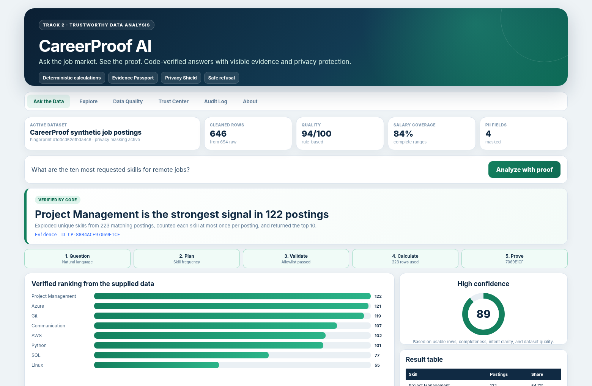
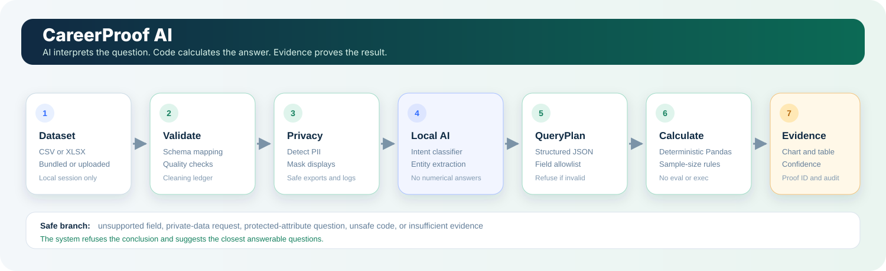

# CareerProof AI

**Ask the job market. See the proof.**

CareerProof AI is a Track 2 trustworthy-data-analysis application for students, recent graduates, career counselors, and workforce-development teams. Users ask questions about job-posting data in normal language. A local AI model interprets the question, but deterministic Pandas code calculates every factual result and exposes the evidence behind it.

> **AI interprets the question. Code calculates the answer.**



*Interface preview generated from a real calculation against the bundled synthetic dataset.*

## Why this project exists

Job seekers are surrounded by listings but often cannot answer basic questions such as:

- Which skills appear most often?
- Which locations have the most entry-level opportunities?
- Which employers post the most internships?
- How much salary data is missing?
- Is an answer based on enough evidence to trust?

A general chatbot can sound confident without calculating from the supplied data. CareerProof AI separates language understanding from calculation and refuses conclusions that the dataset cannot support.

## What the application does

- Loads the bundled demonstration dataset or a user CSV/XLSX file.
- Rejects empty files, files above 100,000 rows, and files above 200 columns with clear validation messages.
- Maps common column names into a canonical schema.
- Validates dates, salaries, categories, duplicates, and missing values.
- Detects and masks recruiter names, emails, phone numbers, and source IDs.
- Classifies question intent locally with TF-IDF and logistic regression.
- Converts the question into a visible, structured `QueryPlan`.
- Validates every field, filter, operation, and metric against an allowlist.
- Calculates the answer with deterministic Pandas operations.
- Shows a chart, result table, masked source rows, calculation steps, sample size, and confidence score.
- Generates a reproducible Evidence ID and downloadable proof bundle.
- Refuses unsupported, unsafe, private, predictive, or discriminatory questions.

## Unique features

### Evidence Passport

Every supported answer receives an Evidence ID derived from the dataset fingerprint, privacy-safe validated query plan, and deterministic result table. Any meaningful calculation change produces a different ID. The Trust Center can re-upload a proof bundle and recompute the ID. When the active dataset matches, CareerProof reruns the validated plan and confirms that the result reproduces instead of trusting a saved answer on its own.

### Refusal Coach

Unsupported questions are not only refused. The interface suggests the closest questions that the supplied dataset can answer with evidence.

### Career Signal Lab

A user can enter skills they already have and compare them with the most frequent required-skill signals for a selected role. The feature shows transparent overlap and missing signals without pretending to predict hiring.

### Scenario Compare

Users can compare two work modes, experience levels, states, or roles across posting count, salary coverage, median salary midpoint, companies represented, and top skill.

### Cleaning Ledger

Every cleaning action is visible. Duplicate IDs, invalid salary ranges, invalid dates, category normalization, and generated IDs are disclosed instead of silently hidden.

## Trust and safety design

| Control | What it prevents |
|---|---|
| Structured query plan | Free-form model-generated code |
| Field and operation allowlists | Arbitrary columns, SQL, Python, `eval`, or `exec` |
| Deterministic executor | Invented numerical answers |
| PII masking | Raw recruiter contacts in UI, reports, downloads, and logs |
| Minimum sample sizes | Small groups presented as reliable salary rankings |
| Confidence engine | Confidence based only on model tone |
| Unsupported-question refusal | Claims about unavailable fields or future outcomes |
| Audit log | Invisible decisions and untraceable calculations |
| Evidence Passport verifier | Modified proof bundles or results that do not reproduce from the active dataset |

## Architecture



1. Load CSV or XLSX.
2. Map and validate the schema.
3. Clean data and record every action.
4. Mask sensitive fields for display and export.
5. Use local AI to classify the question intent.
6. Create and validate a structured query plan.
7. Run deterministic Pandas calculations.
8. Generate evidence, confidence, charts, exports, and an audit event.

More detail is in [docs/architecture.md](docs/architecture.md).

## Bundled dataset

The repository includes `data/raw/job_postings.csv` with 654 raw rows and 646 cleaned rows. It contains fictional companies, contacts, and job listings across multiple roles, locations, work modes, experience levels, salaries, and skills.

> This dataset is synthetic and was generated for demonstration and evaluation. It does not represent current real-world hiring conditions.

The raw data intentionally contains a small number of duplicate IDs, invalid salaries, an invalid date, missing fields, and unknown categories so the quality and cleaning workflow can be demonstrated. No real personal data is included.

## Install

Python 3.11 or newer is required. The simplest setup is:

```bash
python -m pip install -r requirements.txt
```

For development tools, including Ruff, use:

```bash
python -m pip install -r requirements-dev.txt
```

An editable package install is optional:

```bash
python -m pip install -e ".[dev]" --no-build-isolation
```

The app launcher adds the local `src` directory automatically, so `python app.py` works after installing the requirements even without an editable package install.

## Run

```bash
python app.py
```

Open the local URL shown in the terminal, normally `http://127.0.0.1:7860`.

No API key is required.

## Test

```bash
pytest -q
```

## Smoke-test the real application server

```bash
python scripts/smoke_test_app.py
```

The script starts the Gradio app on a temporary local port, waits for HTTP 200, checks the CareerProof title marker, and shuts the process down.

## Run the judge-ready demo checks

```bash
python scripts/run_demo_checks.py
```

## Verify the submission package

```bash
python scripts/verify_submission.py
```

## Build the final ZIP

```bash
python scripts/build_submission.py
```

The package command requires a clean Git working tree, runs a static preflight, records the current commit in the manifest, extracts the ZIP, runs the complete test and demo suites against the packaged files, launches the packaged app, and then reports the final checksum.

The final package is created at:

```text
dist/careerproof-ai-submission.zip
```

## Judge-ready questions

1. Which cities have the most entry-level job postings?
2. What are the ten most requested skills for remote jobs?
3. Which companies have the most internship opportunities?
4. What is the median salary range by experience level?
5. How does estimated salary compare between remote, hybrid, and on-site jobs?
6. What percentage of postings do not disclose salary?
7. How has job-posting volume changed over time?
8. Which skills appear most often in electrical engineering and embedded-systems roles?
9. Which states have the highest number of entry-level engineering jobs?
10. Which companies have the highest median salary among companies with at least five postings?

Expected refusal case:

```text
Which company has the happiest employees?
```

The application explains that the dataset has no employee-satisfaction field and suggests answerable alternatives.

## Evidence exports

Every analysis can export:

- HTML evidence report
- Masked source-row CSV
- Result-table CSV
- Validated query plan JSON
- Full proof bundle JSON
- Data-quality report

The proof bundle can be re-uploaded in the Trust Center. CareerProof checks its content-addressed Evidence ID and, when it belongs to the active dataset, reruns the validated plan to confirm reproducibility.

Reports identify whether the analysis used the bundled synthetic dataset or a user-supplied upload. User uploads are never mislabeled as synthetic.

## Repository structure

```text
app.py                         Launches the Gradio application
src/careerproof/               Data, AI, calculation, privacy, evidence, and UI modules
data/raw/                      Bundled synthetic CSV and formatted workbook
tests/                         Unit, integration, export, refusal, and adversarial tests
scripts/                       Dataset, demo, verification, preview, and packaging tools
docs/                          Architecture, presentation, security, demo, and submission material
templates/report.html          Portable evidence-report template
```

## Known limitations

- The bundled dataset is synthetic and not a live labor-market source.
- The intent model supports a focused set of analysis patterns rather than unrestricted conversation.
- Salary analysis only uses rows with both salary endpoints.
- The app does not predict hiring outcomes or employer quality.
- Trend charts describe the supplied snapshot and are not forecasts.
- Uploaded data remains local to the running process, but production deployment would need authentication, encrypted storage, access controls, and retention rules.

## Data, APIs, and dependencies

- No external API is required.
- No live job-board data is used.
- The included dataset is participant-generated synthetic data.
- Third-party packages and licenses are listed in [THIRD_PARTY_NOTICES.md](THIRD_PARTY_NOTICES.md).
- Data details are in [data/README.md](data/README.md) and [docs/data_dictionary.md](docs/data_dictionary.md).

## Pre-existing work disclosure

See [PREEXISTING_WORK.md](PREEXISTING_WORK.md). Project-specific code, tests, synthetic data, diagrams, and documentation were created for this hackathon. Open-source packages and the organizer participant guide are disclosed dependencies and references.

## Submission assets

- [Judging alignment](JUDGING_ALIGNMENT.md)
- [Submission checklist](SUBMISSION_CHECKLIST.md)
- [Submission description](docs/submission_description.md)
- [Presentation](docs/presentation.md)
- [Demo script](docs/demo_script.md)
- [Judge demo cheat sheet](docs/judge_demo_cheatsheet.md)
- [Checkpoint pack](docs/checkpoint_pack.md)
- [Testing report](docs/testing_report.md)
- [Security and privacy](docs/security_and_privacy.md)
