# CareerProof AI 5.0 Redesign and Intelligence Report

Date: August 1, 2026  
Version: **5.0.0-revamped**  
Track: **Trustworthy Data Analysis**

## Release result

CareerProof AI 5.0 implements the approved visual and product plan in the working FastAPI application. The original official datasets, deterministic calculations, source lineage, Evidence Passports, and safety boundaries remain intact. The redesign is not a static mockup. Every screen below is captured from the live application with real endpoint responses.

The implementation closely translates the approved references while adapting them to responsive HTML, CSS, SVG, keyboard navigation, evidence requirements, and the existing backend contracts.

## Product principle

> **AI interprets. Code calculates. Evidence verifies. You decide.**

The homepage now leads with:

> **Build a future that evolves with AI, not one that depends on outrunning it.**

CareerProof consistently uses **AI-resilient** rather than claiming any career is permanently AI-proof.

## Implemented workspaces

### 1. Homepage

- Quote-led hero with a professional pathway and illuminated destination
- No planet imagery outside Career Universe
- Compact profile snapshot, official-data coverage strip, featured career, and task-impact overview
- Reduced copy, clearer hierarchy, and one dominant action

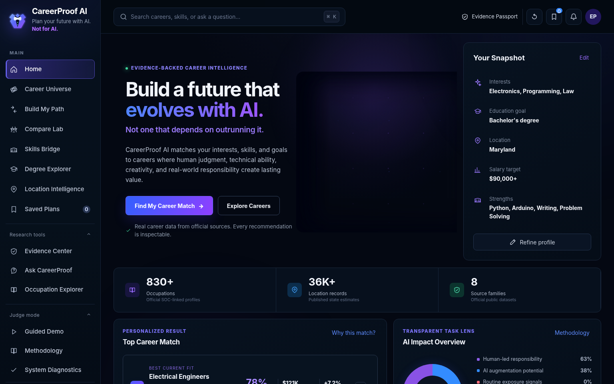

### 2. Career Universe

- Central profile sun and eight career-field planets
- Distinct field colors and restrained star field
- Planet selection, field focus, fixed career moons, and full career profile
- Right-side evidence panels and accessible list fallback
- Reduced-motion support and keyboard-operable career controls

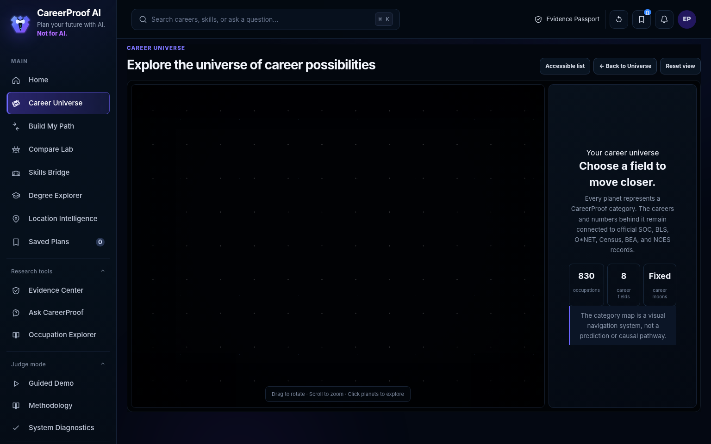

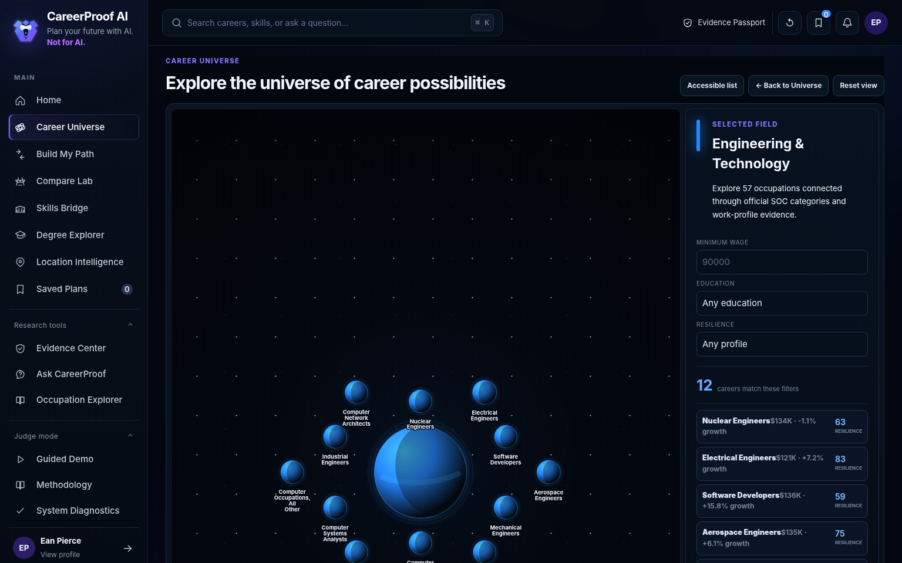

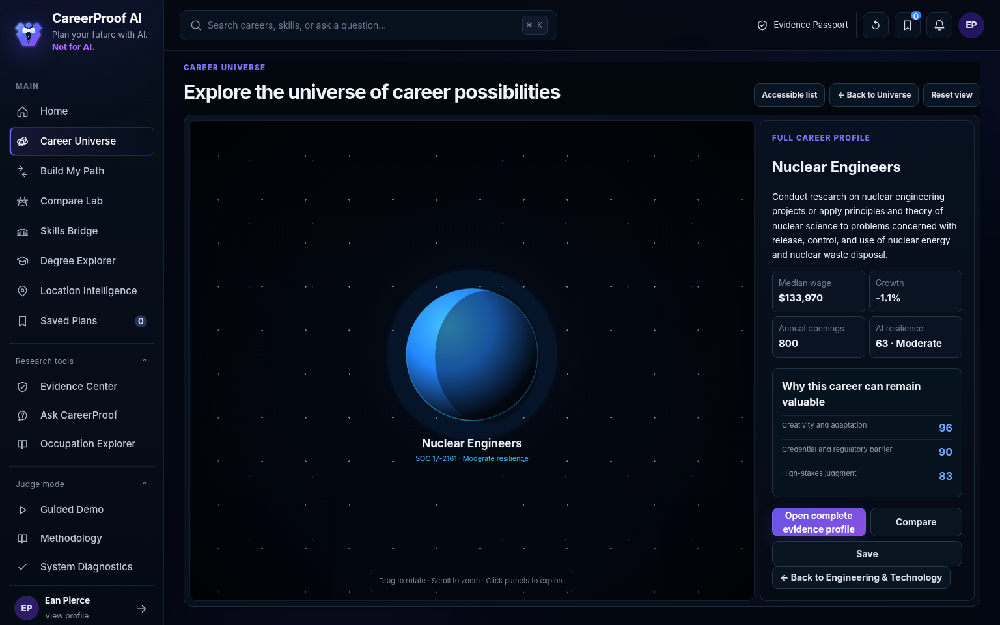

### 3. Build My Path

- Four stages: About You, Priorities, Interpretation, Results
- Visible typo repairs and human-error review
- Editable AI interpretation before calculation
- Three focused career cards with a leading result
- Eight score components, hard constraints, counterfactuals, portfolio strategy, challenge, evidence, save, and compare
- Progressive disclosure keeps the initial decision readable

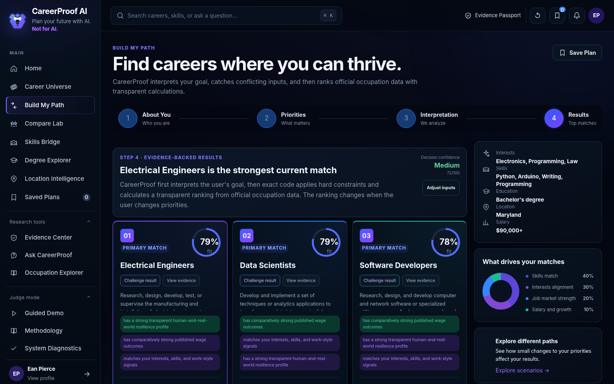

### 4. Compare Lab

- Professional two-career battle presentation
- Distinct contender colors and a clear evidence-based winner
- Eight battle categories
- Tabs for overview, tradeoffs, scenarios, and evidence
- Explicit score gap, feasibility, setup summary, and key takeaways

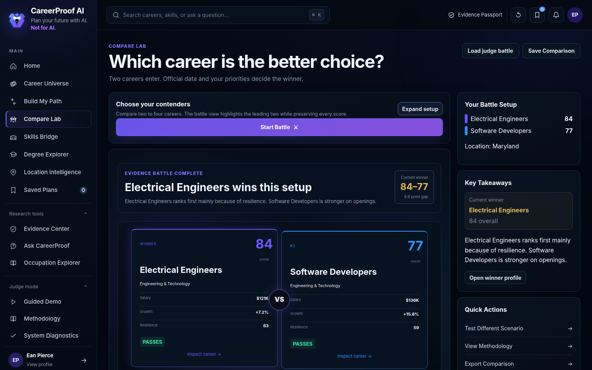

### 5. Skills Bridge

- Current career and target career placed on opposite sides of a visual bridge
- Transferable skills and missing skills rendered as bridge components
- Readiness score, estimated transition window, and learning roadmap
- Clear boundary that occupational similarity is not personal readiness or a hiring guarantee

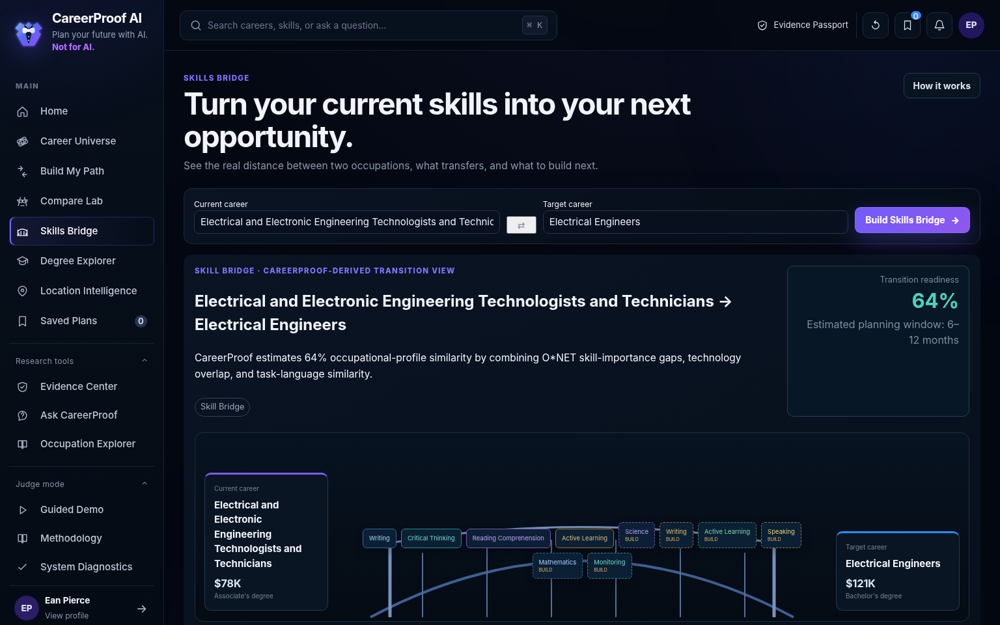

### 6. Evidence Center

- Four-stage trust journey: sources, calculations, scoring, guardrails
- Official source cards with agency, vintage, and use
- Direct, transformed, and CareerProof-derived values kept separate
- Quality, coverage, diagnostics, and unsupported-claim boundaries

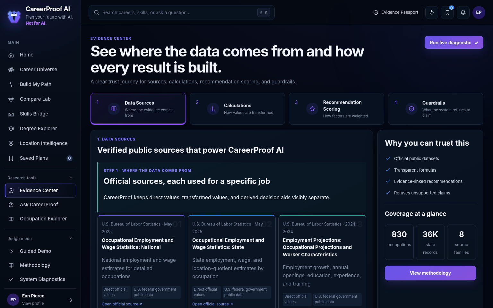

### 7. Ask CareerProof

- Conversation and live evidence shown side by side
- Context preservation and compact query interpretation
- Query plan, source lineage, confidence, calculation, and result rows remain inspectable
- Supported answer and safe-refusal behavior use the same controlled routing layer

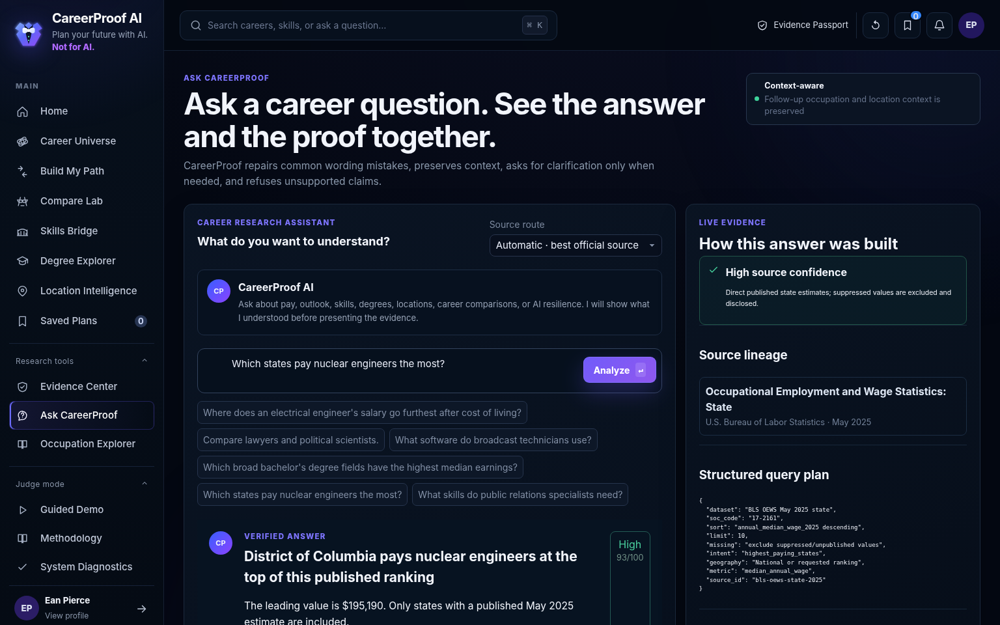

### 8. Occupation Explorer

- Search-first unified occupation profile
- Salary, range, growth, openings, resilience, and education at a glance
- Tabs for work, skills, education, outlook, locations, and evidence
- Save, compare, and Evidence Passport actions

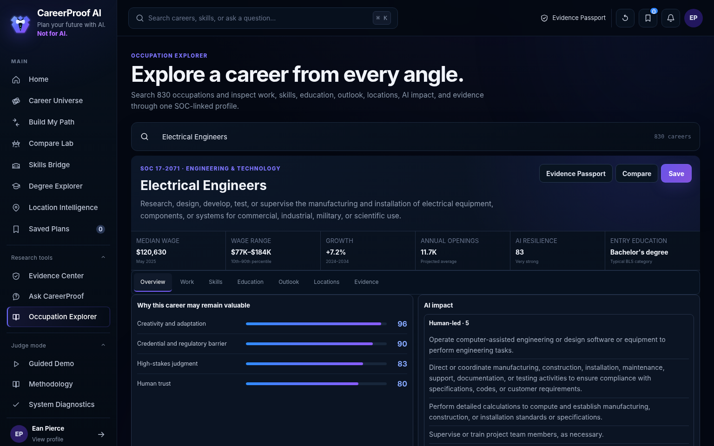

### 9. Degree Explorer

- Degree-first and career-first modes
- Official qualitative CIP-to-SOC relationships
- Academic pathway milestones and connected careers
- Explicit warning that a crosswalk is not a placement rate or required-degree claim

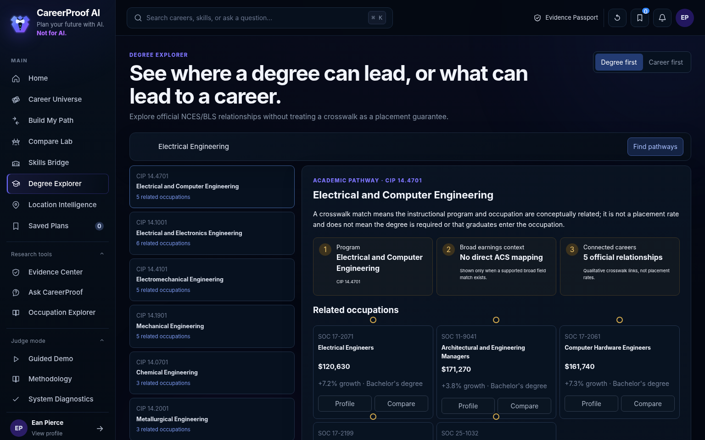

### 10. Location Intelligence

- Nominal pay, purchasing power, employment, concentration, quality, and derived opportunity score
- Visible formula and source-boundary language
- Geographic visual used as a ranking aid rather than pretending to be a precise map visualization

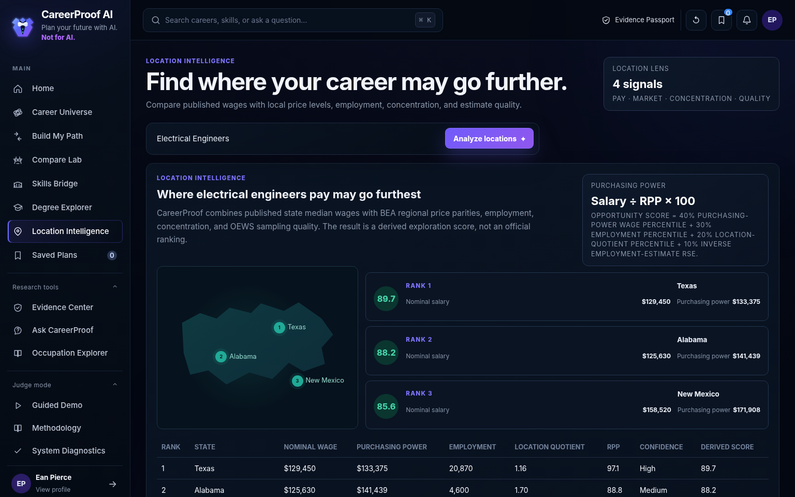

### 11. My Career Plan

- Saved careers transformed into a decision workspace
- Leading choice, shortlist, portfolio roles, milestones, and decision journal
- Clear next actions across skills, education, comparison, and location research

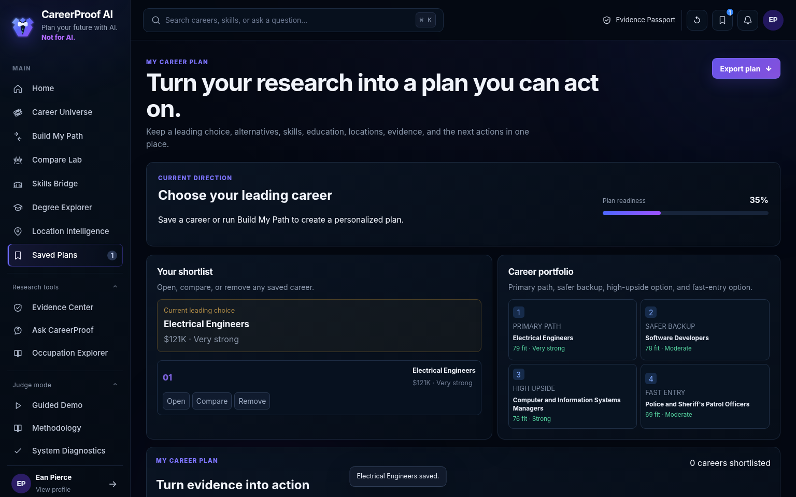

### 12. Judge Mode

- Ten-stage full presentation and six-stage quick pitch
- Presenter narration, timeline, rubric proof, autoplay, keyboard controls, and one-click reset
- Live feature launch from the relevant presentation step
- Larger readable presentation typography and restrained presentation controls

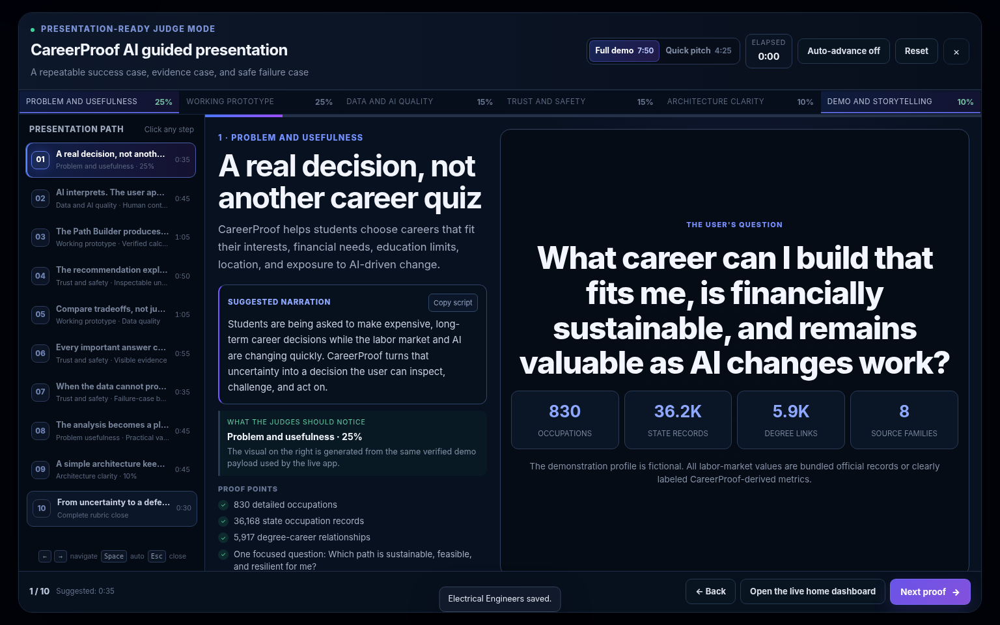

## Intelligence upgrades

### Stronger interpretation

- Repairs common misspellings and discloses the correction
- Resolves occupation, degree, location, salary, skills, AI exposure, comparison, and transition intents
- Preserves follow-up occupation and location context
- Converts free text into an editable profile rather than directly generating a recommendation

### Human-error protection

- Checks missing required inputs
- Detects unusual salary targets and conflicting education constraints
- Reviews repeated or unresolved choices
- Keeps Edit, Back, Reset, and Confirm controls throughout major workflows
- Never silently changes a user choice

### Confidence-aware behavior

- Separates source confidence from decision confidence
- Discloses missing, suppressed, partial, or differently dated evidence
- Avoids presenting a close comparison as certain
- Refuses guarantees, discriminatory claims, arbitrary-code requests, and unsupported live-job claims
- Suggests a supported alternative when a question cannot be answered

### Calculation protection

1. Controlled AI interprets the request.
2. Deterministic code retrieves official records and calculates results.
3. Validation rules check constraints, missing values, and output shape.
4. Evidence lineage identifies the exact source and calculation.
5. The explanation is generated from the verified result.

## Visual system

The application shares a near-black and deep-navy foundation, larger typography, thin borders, consistent radii, and restrained motion. Pages receive distinct accents so the product remains cohesive without becoming visually repetitive:

- Homepage: indigo, violet, and warm destination light
- Career Universe: field-specific blue, purple, teal, orange, gold, coral, cyan, and green
- Build My Path: violet workflow, green fit, blue evidence, gold opportunity
- Compare Lab: contender-specific colors with restrained winner gold
- Evidence Center: teal, blue, green verification, amber limitations
- Skills Bridge: violet current side, blue target side, categorized skill accents
- Degree Explorer: academic blue and gold
- Location Intelligence: teal and map green
- My Career Plan: blue with milestone gold
- Judge Mode: neutral presentation canvas with one active accent

## Accessibility and responsive behavior

- Full keyboard navigation for core controls
- Visible focus states
- No information communicated only through color
- Reduced-motion media query
- Career Universe list fallback
- Mobile sidebar drawer and stacked cards
- Swipe-friendly and vertically reflowed comparison content
- Right-side desktop panels become stacked mobile sections
- Verified zero horizontal overflow at 390 pixels

## Performance protections

- SVG and CSS visuals instead of background video
- Fixed Career Universe moons rather than continuously animated orbit systems
- GPU-friendly transforms and short transitions
- Detailed evidence loaded only when requested
- Repeated data operations use the existing indexed and cached backend store

## Release validation

| Gate | Result |
|---|---:|
| Unit and integration tests | **83/83 passed** |
| Workflow and supported-question checks | **19/19 passed** |
| Judge diagnostics | **11/11 passed** |
| Chromium browser acceptance | **39/39 passed** |
| Browser console errors | **0** |
| Browser page errors | **0** |
| Mobile horizontal overflow at 390 px | **0 px** |
| Python compilation | **Passed** |
| JavaScript syntax | **Passed** |
| Server startup and health endpoint | **Passed** |

Machine-readable results:

- `docs/browser_acceptance_results.json`
- `docs/judge_diagnostic_results.json`
- `docs/demo_check_results.json`
- `docs/release-logs/`

## Rubric self-assessment

This is an internal readiness assessment, not a promise of a judge score.

| Category | Weight | Readiness estimate |
|---|---:|---:|
| Problem and usefulness | 25 | 24.5 |
| Working prototype | 25 | 25.0 |
| Data and AI quality | 15 | 14.5 |
| Trust and safety | 15 | 15.0 |
| Architecture clarity | 10 | 9.5 |
| Demo and storytelling | 10 | 9.5 |
| **Total** | **100** | **98.0** |

The largest remaining factors are external to the codebase: live presentation delivery, public hosting authorization, video quality, and the judges’ subjective preferences.
